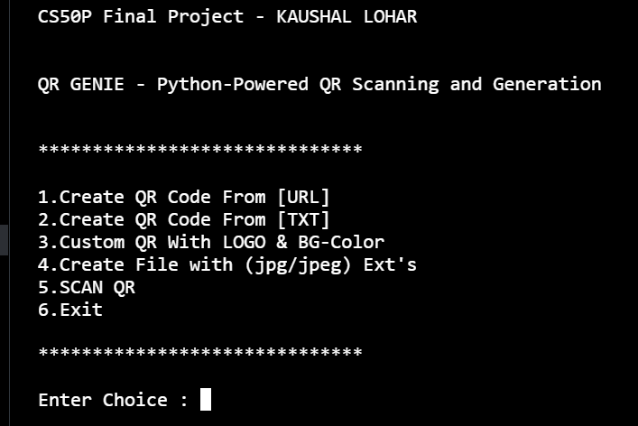

# QR Genie: Python-Powered QR Scanning and Generation


## Description :
This is the project
Titled as ' QR Genie: Python-Powered QR Scanning and Generation'
This program offers a comprehensive suite of features for both scanning and generating QR codes.
It also provides way to have QR files in different extensions

## Video Link
- [Youtube video link](https://youtu.be/BsTfvOXIvGY)


## Features

- Creation of QR code using URL
- Creation of QR code using Text
- Creation of Custom QR code ( with logo and background color )
- Creation of files with extensions ( jpg , jpeg )
- Scanning of QR code
<!--  -->
<!--  -->



## Installation

Install QR Genie

```
    1.Ensure you have Python installed on your machine.
    2.Clone the repository.
    3.Navigate to the project directory.
    4.Install necessary packages.
    5.Run the program.
```
## Sourcecode explaination
```
def main():
    os.system('clear')
    print('\nCS50P Final Project - KAUSHAL LOHAR\n')
    print('\nQR GENIE - Python-Powered QR Scanning and Generation\n')

```
This part defines the main() function which is the entry point of the program. It starts by clearing the console and then prints some information about the project

```
    while True:
        print('\n******************************\n')
        print('1.Create QR Code From [URL]')
        print('2.Create QR Code From [TXT]')
        print('3.Custom QR With LOGO & BG-Color ')
        print('4.Create File with (jpg/jpeg) Ext\'s')
        print('5.SCAN QR')
        print('6.Exit\n')
        print('******************************')

```
Inside the main() function, there is a continuous loop that displays a menu of options to the user.

```
    choice = int(input('\nEnter Choice : '))

```
The statement prompts the user to enter a choice from the menu and converts the input to an integer.
```
    match choice:
        case 1:
            user_url = accept_url()
            if not validate_url(user_url):
                print('\n!!! Not a valid url ')
                print(' url format -> https://www.example.com')
            else:
                img = simple_qr(user_url)
                if not img:
                    print("QR Not Generated")
                print(f"File {img} created")

```
Here, the program uses a match statement (introduced in Python 3.10) to handle the user's choice. Case 1 is for creating a QR code from a URL. The accept_url() function presumably gets the URL from the user, and validate_url() checks if it's a valid URL format. If the URL is valid, the simple_qr() function generates a QR code image. If img is not generated (evaluates to False), a message is printed. Then, the name of the generated image file is printed.

The other cases (2 to 6) are similar in structure, each handling a specific operation such as creating QR codes from text, creating custom QR codes with a logo and background color, generating files with specific extensions, scanning QR codes, and exiting the program.

#### Functions
```
def accept_url():
    user_url = input('Enter Url ')
    return user_url

```
def accept_url():: This line defines a function named accept_url.

user_url = input('Enter Url '): The function prompts the user to enter a URL by displaying the text "Enter Url ". The input() function captures the user's input from the keyboard and assigns it to the variable user_url.

return user_url: Once the user has entered the URL, the function returns the entered URL as its output value.

This function is meant to be used in the main code for collecting a URL input from the user, and the entered URL can then be used in subsequent parts of the program. It provides a simple and reusable way to gather URL inputs without duplicating code.

```
def validate_url(user_url):
    if validators.url(user_url):
        return True
    else:
        return False
```
def validate_url(user_url):: This line defines a function named validate_url that takes a single parameter user_url, which is the URL to be validated.

if validators.url(user_url):: This line uses the validators.url() function to check if the provided user_url is a valid URL. The validators module is presumably imported elsewhere in the code and contains functions for various types of validations.

return True: If the URL is valid, the function returns True.

else:: If the URL is not valid,

return False: The function returns False.

In summary, this function checks whether a given URL is valid using the validators.url() function and returns True if it's valid, and False otherwise. This validation can be useful to ensure that only properly formatted URLs are used in the program.
```
def read_qr(file_path):
    img = cv2.imread(file_path)
    qr_det = cv2.QRCodeDetector()
    ret_val , decoded_info, points , _ = qr_det.detectAndDecodeMulti(img)
    if ret_val :
        print("Decoded QR code : \n\t",decoded_info)
    else:
        print("No QR found in image")
```
def read_qr(file_path):: This line defines a function named read_qr that takes a single parameter file_path, which is the path to the image file containing the QR code.

img = cv2.imread(file_path): The function uses the cv2.imread() function to read the image located at file_path and stores it in the variable img.

qr_det = cv2.QRCodeDetector(): This line initializes an instance of the cv2.QRCodeDetector() class, which is part of the OpenCV library and is used for detecting and decoding QR codes in images.

ret_val, decoded_info, points, _ = qr_det.detectAndDecodeMulti(img): Here, the detectAndDecodeMulti() function of the qr_det instance is used to detect and decode QR codes in the provided image (img). The function returns several values:

ret_val: A boolean value indicating whether QR codes were detected and decoded successfully.
decoded_info: A string containing the decoded information from the QR code(s).
points: Coordinates of the corners of the detected QR code(s).
_: This variable is used to discard some additional information that isn't needed in this context.
if ret_val:: If QR code(s) were successfully detected and decoded,

print("Decoded QR code : \n\t", decoded_info): The function prints the decoded information from the QR code(s).

else:: If no QR code was found or the decoding was not successful,

print("No QR found in image"): The function prints a message indicating that no QR code was found in the provided image.

Overall, this function reads and decodes QR codes from an image file using OpenCV's QR code detection and decoding capabilities. It then prints out the decoded information if successful, or a message if no QR code was detected.

```
def list_qr_codes(folder_path):
    img_exts = ['.png','.jpg','.jpeg']
    print("\n\tScan-able's are : ")
    for root,dirs,files in os.walk(folder_path):
        for file in files:
            if any(file.lower().endswith(ext) for ext in img_exts):
                file=str(os.path.join(root,file)).replace(folder_path,'')
                print('\t',file)
```
def list_qr_codes(folder_path):: This line defines a function named list_qr_codes that takes a single parameter folder_path, which is the path to the folder where image files are to be listed.

img_exts = ['.png', '.jpg', '.jpeg']: This line defines a list of image file extensions that the function is interested in (png, jpg, and jpeg).

print("\n\tScan-able's are : "): The function starts by printing a message indicating that the list of scan-able files will be displayed.

for root, dirs, files in os.walk(folder_path):: This for loop iterates through the files and directories within the specified folder_path and its subdirectories. The os.walk() function generates the root directory, directories, and files in a top-down manner.

for file in files:: Inside the loop, for each file in the current directory,

if any(file.lower().endswith(ext) for ext in img_exts):: This line checks if the lowercase version of the file name ends with any of the specified image extensions (img_exts). The any() function returns True if at least one of the conditions is True.

file = str(os.path.join(root, file)).replace(folder_path, ''): If the file matches one of the specified extensions, this line constructs the full path to the file using os.path.join(root, file) and then removes the folder_path from the beginning of the path using replace(). This is done to provide a relative path for printing.

print('\t', file): Finally, the function prints the relative path of the image file that matches one of the specified extensions. The '\t' is used for formatting, adding an indentation to the printed output.

 this function lists image files with .png, .jpg, and .jpeg extensions in the specified folder and its subdirectories. It provides relative paths for these files to be displayed in the console
```
def simple_qr(url_str):
    if (validate_url(url_str)):
        url = pyqrcode.create(url_str)
        parsed_url = urlparse(url_str)
        domain = parsed_url.netloc.replace("www.", "").replace('.com','').replace('.ac','').replace('.edu','').replace('.gov','').replace('.in','')
        image_name = f"{domain}.png"
        url.png(f'{image_name}', scale = 6)
        return image_name
    else:
        return False
```
def simple_qr(url_str):: This line defines a function named simple_qr that takes a single parameter url_str, which is the URL for which the QR code will be generated.

if validate_url(url_str):: This line checks if the provided url_str is a valid URL using the validate_url() function. If it's a valid URL,

url = pyqrcode.create(url_str): The function creates a QR code object using the pyqrcode.create() function and the provided url_str.

parsed_url = urlparse(url_str): This line uses the urlparse() function from the urllib.parse module to parse the provided URL and break it into its components.

domain = parsed_url.netloc.replace("www.", "").replace(...): Here, the domain name is extracted from the parsed URL's netloc component. Substrings like "www.", ".com", ".ac", ".edu", ".gov", and ".in" are replaced with an empty string to get a cleaner version of the domain.

image_name = f"{domain}.png": The image filename is created based on the cleaned domain name, with the .png extension.

url.png(image_name, scale=6): The url object (the QR code) is converted to a PNG image and saved with the generated image_name. The scale parameter determines the size of the QR code within the image.

return image_name: If everything is successful, the function returns the generated image filename.

else:: If the provided URL is not valid,

return False: The function returns False to indicate that the QR code was not generated.

 this function creates a QR code image from a provided URL, cleans the URL's domain to create an image filename, and saves the QR code as a PNG image. It returns the image filename if successful and False if the URL is not valid.

```
def more_extension_qrcodes(source_filename, target_extensions):
    with open(source_filename, 'rb') as source_file:
        content = source_file.read()

    for extension in target_extensions:
        target_filename = f"{source_filename.rsplit('.', 1)[0]}.{extension}"
        with open(target_filename, 'wb') as target_file:
            target_file.write(content)
        print(f"File {target_filename} created.")
```
def more_extension_qrcodes(source_filename, target_extensions):: This line defines a function named more_extension_qrcodes that takes two parameters: source_filename, which is the name of the source file, and target_extensions, which is a list of target extensions for creating new copies of the source file.

with open(source_filename, 'rb') as source_file:: The function opens the source_filename in binary read mode ('rb') using a with statement, ensuring proper file handling.

content = source_file.read(): The content of the source file is read and stored in the content variable.

for extension in target_extensions:: The function iterates over each target extension specified in the target_extensions list.

target_filename = f"{source_filename.rsplit('.', 1)[0]}.{extension}": For each extension, a target filename is created by removing the current extension from the source_filename using rsplit('.', 1)[0] and appending the new extension.

with open(target_filename, 'wb') as target_file:: The function opens the target file in binary write mode ('wb') using another with statement.

target_file.write(content): The content read from the source file is written to the target file.

print(f"File {target_filename} created."): A message is printed indicating that the target file has been created.

In summary, this function takes a source filename and a list of target extensions. For each extension, it reads the content of the source file and writes it into a new file with the specified extension. This is a way to create multiple copies of the same content in different format

```
def custom_qr(url, logo_path, qr_color):
    logo = Image.open(logo_path)
    basewidth = 100
    wpercent = (basewidth / float(logo.size[0]))
    hsize = int((float(logo.size[1]) * float(wpercent)))
    logo = logo.resize((basewidth, hsize), Image.BILINEAR)
    QRcode = qrcode.QRCode( error_correction=qrcode.constants.ERROR_CORRECT_H )
    QRcode.add_data(url)
    QRcode.make()

    QRimg = QRcode.make_image(fill_color=qr_color, back_color='white').convert('RGB')
    pos = ((QRimg.size[0] - logo.size[0]) // 2, (QRimg.size[1] - logo.size[1]) // 2)
    QRimg.paste(logo, pos)

    parsed_url = urlparse(url)
    domain = parsed_url.netloc.replace("www.", "").replace('.com','').replace('.ac.in','').replace('.edu','')
    image_name = f"{domain}"
    QRimg.save(f'{image_name}.png')

    return image_name
```
custom_qr(url, logo_path, qr_color)
This function creates a custom QR code with a logo on it. It uses the qrcode library to generate the QR code, the Image module from the PIL (Pillow) library to manipulate the logo, and OpenCV to handle the image processing.

logo = Image.open(logo_path): The function opens the logo image located at logo_path using the PIL library's Image.open() function.

logo = logo.resize(...): The logo is resized to fit within a specified width while maintaining its aspect ratio.

QRcode = qrcode.QRCode(...): A QRCode instance is created using the qrcode library with error correction settings.

QRimg = QRcode.make_image(...): The QR code image is generated with the specified qr_color and a white background.

QRimg.paste(logo, pos): The resized logo is pasted onto the QR code image at a specified position.

QRimg.save(f'{image_name}.png'): The final QR code image with the logo is saved using the domain name extracted from the provided URL.

The function returns the image_name (which is derived from the domain name) as the name of the generated QR code image.

This function is a part of a program that can generate customized QR codes with logo and background colour. It combines various libraries, including qrcode, PIL, and OpenCV, to achieve these tasks.

```
if __name__ == "__main__":
    main()
```
__name__ is a special built-in variable in Python. When a Python script is executed, the __name__ variable is set to "__main__" for the script that's being run directly.

The line if __name__ == "__main__": checks whether the value of __name__ is equal to "__main__".

If the condition is True, it means the script is being run directly. The code block indented under this condition will be executed.

In your case, main() is the function that contains the main logic of your program. So, when the script is run directly, the main() function is executed, and your program's functionality is initiated.

## Files
### Project.py
It contains source code of the project including main function and other utility functions such as accept_url() , validate_url(user_url) , simple_qr(url_str) , more_extension_qrcodes(source_filename, target_extensions) , custom_qr(url, logo_path, qr_color) .

### example_assets
It contains a demo logo of oneplus to include in a custom QR . QRGenie is the Logo GIF and feature.png is the screenshot of features of the project.other_qr.png is a randomly generated QR code from a Website to check if the scanner in this project works on other QR codes or not

### test_project.py
It contains manual tests to be run on some functions of project.py file.
It has these functions : test_validate_url() , test_simple_qr() , test_custom_qr() .
These functions run tests on functions validate_url() , simple_qr() , custom_qr() respectively .

### requirements.txt
It contains all the pip installable libraries or import statements.
such as :
- import pyqrcode
- import os
- import validators #to validate url
- from PIL import Image
- import qrcode
- import cv2
- from urllib.parse import urlparse
### https:
It contains the link of the demo video presentation uploaded on youtube of the project.
```
https://youtu.be/BsTfvOXIvGY
```
### other files
All the other files are the QR created from the project such as
- google.png
- oneplus.png
- text_qr_1.jpeg
- text_qr_1.png
- text_qr_1.jpg


## output images of QR


## Usage
Steps to Use the project:

- Launch the program.
- Choose one of the features by entering the corresponding number.
- Follow on-screen instructions for each feature.

note - Always ensure to have the most recent version of the software for optimal functionality.


## Authors

- [@Kaushal-lohar](https://www.github.com/kaushal016)

## Linkedin
- [Kaushal Lohar](www.linkedin.com/in/kaushal-dev)

## Support

For support, email @kaushallohar016@gmail.com .

## Feedback
For feedback , please reach out to us at @kaushallohar2@gmail.com

## Location
Pune , Maharashtra , India

## Created On :
2023-08-16


